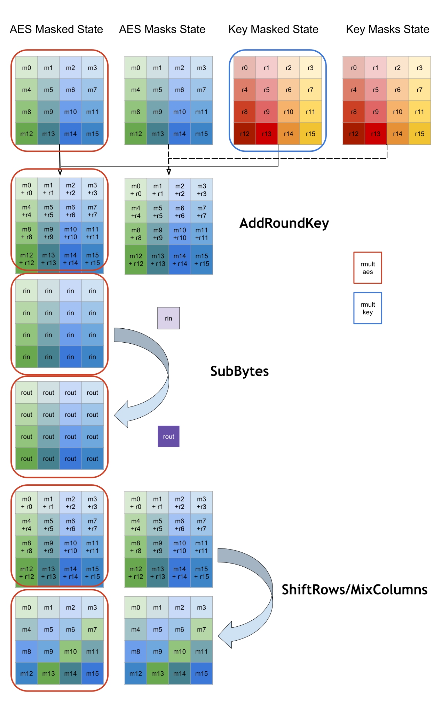
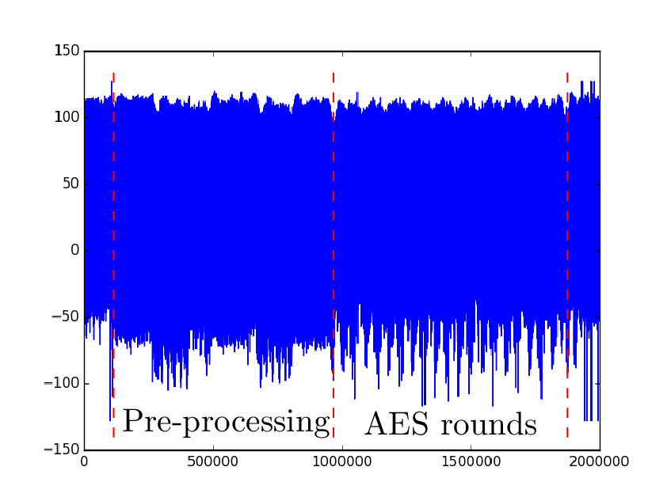

# Hardened Library for AES-128 encryption/decryption on ARM Cortex M4 Achitecture

**Authors:** Ryad Benadjila, Louiza Khati, Emmanuel Prouff and Adrian Thillard

This work is linked to the H2020 funded project **[REASSURE](http://reassure.eu/)**. 

## Introduction

The members of ANSSI's laboratory of embedded security have developed a `C` library to perform AES-128 encryption and decryption on 32-bit Cortex-M ARM architecture while taking Side-Channel Attacks (SCA for short) into account.

The implementation codes are published for research and pedagogical purposes only.

The platforms on which the code has been tested are the STM32F3 and STM32F4, but **should be compatible with any Cortex-M3/Cortex-M4 using the Thumb-2 ARMv7-M instruction set**.

The STM32 MCUs are not secure ones; in particular no effort has been made to harden them against side-channel attacks and fault injections (e.g. clock jittering, shield, etc.). The information leakage is consequently particularly high and there is almost no jittering (traces' acquisition should therefore not suffer from too much de-synchronization). To secure the implementation, it has been chosen to apply state of the art techniques.

## Project Description

This project aims at proposing a `C` library to perform AES-128 encryption and decryption on `32-bit Cortex M4 ARM` architecture while taking Side-Channel Attacks into account.

To ease the use of the library, the AES-128 primitive can be executed by calling the following function:

`UINT aes(UCHAR Mode, STRUCT_AES* struct_aes, const UCHARp key, const UCHARp input, UCHARp output, UCHARp random_key, UCHARp random_aes)`

where:

- `key` is the 16-byte AES-128 master key,
- `input` is a `16`-byte array referring either to the plaintext to encrypt (in encryption mode) or to the ciphertext to decrypt (in decryption mode),
- `output` is a `16`-byte array in which the result will be saved,
- `MODE` is an unsigned char describing the mode in which the AES-128 primitive has to be executed. It can be a combination of the following options:
  - `MODE_KEYINIT`,
  - `MODE_AESINIT_ENC`,
  - `MODE_AESINIT_DEC`,
  - `MODE_AES_ENC`,
  - `MODE_AES_DEC,`
  - `MODE_RANDOM_KEY_EXT`,
  - `MODE_RANDOM_AES_INT`. 
- `STRUCT_AES*` is a pointer to a structure with the following fields:
  -  `STRUCT_KEY_CONTEXT key_context`; refers to a structure dedicated to the master key manipulation (see file `affine_aes.h` in `src/aes/` repository for a detailed description),
  -  `STRUCT_AES128_CONTEXT aes_context`; refers to a structure dedicated to the AES secure execution (see `affine_aes.h` in `src/aes/` for a detailed description),
  -  `UINT ctr_aes`; used to count the number of encryption/decryption under the same AES randomness,
  -  `UINT ctr_key`; used to count the number of encryption/decryption under the same KEY randomness,
  -  `UCHAR state`; used to record the current state of the different initializations (in particular the `STRUCT_KEY_CONTEXT`and `STRUCT_AES128_CONTEXT` structures).
- `random`; random values are to secure the execution against SCA. They are either generated internally, or generated externally and given to the API through two dedicated arrays (`random_key` and `random_aes`). In the latter case, the mode `MODE_RANDOM_KEY_EXT` (if random material for key masking is generated externally) or `MODE_RANDOM_AES_EXT` (if random material for aes masking is generated externally) has to be set on.
  - `random_key` is a 19-byte array containing random values that are used to secure the key manipulation and round keys scheduling,
  - `random_aes` is a 19-byte array containing random values that are used to secure the AES-128 processing.


An example of AES-128 execution is given here-after:

```
UINT Mode;
STRUCT_AES aes_struct;
UCHAR key[16] = {0x2b,0x7e, 0x15, 0x16 ,0x28, 0xae, 0xd2, 0xa6, 0xab, 0xf7, 0x15, 0x88, 0x09, 0xcf, 0x4f, 0x3c};		
UCHAR in[16] = {0x32,0x43, 0xf6, 0xa8, 0x88, 0x5a, 0x30 , 0x8d, 0x31, 0x31, 0x98, 0xa2, 0xe0, 0x37, 0x07, 0x34};
Mode = MODE_KEYINIT|MODE_AESINIT_ENC|MODE_ENC;
ret = aes(Mode, &aes_struct, key, in, out);
```

## Project compilation and tests

### Testing the implementation

In order to test the masked AES implementation, we have chosen to provide three different targets:
- Compiling with `gcc` or `clang` and testing using the QEMU static emulator;
- Compiling with `Keil` and testing using the embedded emulator;
- Compiling with `gcc` and testing on a target board. The board we currently support is the [STM32F4Discovery](https://www.st.com/en/evaluation-tools/stm32f4discovery.html) based on a STM32 Cortex-M4 F407 MCU.

The two first tests only require **software** to compile and check the implementation, while the
last one requires **dedicated hardware** (an STM32F4Discovery board and UART converters to communicate
with a host PC).

### Dependencies to install

The strict minimum required to compile the project is a **cross-toolchain** that targets ARMv7-M MCUs. Depending on the target you choose (QEMU, Keil or STM32F4Discovery) different toolchains are used.

For compiling for QEMU, an `arm-linux-gnueabi-gcc` toolchain is needed:
```
$ sudo apt-get install gcc-arm-linux-gnueabi
```

For testing with QEMU, the static versions of the emulator are needed:
```
$ sudo apt-get install qemu-user-static
```

For compiling and testing with Keil, the [Keil ARM MDK](http://www.keil.com/products/arm/mdk.asp) is required.
**The demo version should be sufficient to test the project.**

For compiling for the STM32F4Discovery board, you will use a `gcc-arm-none-eabi` toolchain:
```
$ sudo apt-get install gcc-arm-none-eabi
```

The QEMU and on board tests use Python scripts that require some packages that you can install
using your distro package manager or `pip`:

```
$ sudo apt-get install python-crypto
$ sudo apt-get install python-serial
```

`python-crypto` is used to generate AES test vectors, and `python-serial` is used for the UART serial
communication with the STM32F4Discovery board.

Finally, for programming the board with the compiled firmware, the [st-link](https://github.com/texane/stlink) utility is needed. Some Linux distros provide it as a package, others not. In any case, you can compile and install this software by following the [dedicated section of this project](https://github.com/texane/stlink/blob/master/doc/compiling.md).

### Compiling

Once the compilation toolchains and/or Keil are installed, it is possible to compile the project.

A `Makefile` is present at the root folder of the project. Here is the help of the targets:

```
$ make
Please choose the target you want to compile:
	make qemu
	=> for qemu target compilation
	===============================
	make firmware
	=> for firmware target compilation, for the STM32Discovery F407 board
	===============================
	make burn
	=> for firmware burning on the STM32Discovery F407 board.
	   Burning uses the st-utils tools.
	===============================
	The masked AES static library can also be compiled using the dedicated target:
	make libaes
	NOTE: use the UNROLL=1 environment variable to force the fully unrolled version compilation
```

Compiling is then as straightforward as `make qemu` for the QEMU target, and `make firmware` for generating a full firmware for the STM32Discovery board.

Two variants of the masked AES implementation are provided: a fast version where most of the loops
are fully unrolled, and a slower version with almost no unrolling. The fast unrolled version uses more non-volatile (flash) memory. By default, the project compiles the small footprint version: the fast unrolled one can be activated using the `UNROLL=1` environment variable:`UNROLL=1 make qemu` or `UNROLL=1 make firmware`.

The Makefile will produce its binaries in a `build` folder. For flexibility and versatility, the various subparts of the project are built as **static libraries**: this helps using them as standalone elements. The masked AES is compiled as `libmaskedaes.a` that can be linked against various other object files.

In order to compile with Keil, you can open the [dedicated project](keil/aes_m4.uvprojx) in the [keil folder](keil) and run the compilation process (tests have been performed with version `µVision V5.26.2.0`).

The STM32Discovery firmware is produced in the files `firmware.bin` (flat binary), `firmware.elf`
(ELF file) and `firmware.hex` (Intel HEX format file). You can use the `make burn` target to push the firmware on the board (provided that st-link binaries are installed and in your path). 

**NOTE1**: the Makefile is built to be versatile regarding the toolchain and options in order to bring flexibility for advanced users. You can override the cross-compiler using the `COMPILER` environment variable, override the `ar` utility with the `AR` variable, and override the `objcopy` utility with the `OBJCOPY` variable. You can also override the `CFLAGS` and `LDFLAGS` environment variables with your own. A simple example of such advanced usage is compiling the QEMU binary with **clang** (provided that the clang and LLVM toolchain is installed):

```
$ COMPILER=clang make qemu
clang -fPIC -fno-builtin -Os -g -mcpu=cortex-m4 -march=armv7e-m -DSTATIC_TESTS_PRESENT -I"./generated_tests" -Isrc/aes -Isrc/printf -Isrc/tests -Isrc  --target=arm-linux-gnueabi -DUSE_QEMU_PLATFORM src/printf/printf.c -c
ar rcs build/libprintf.a  build/printf.o
...
```

**NOTE2**: some compilation toolchains might arise issues during compilation, but such issues
could be related to bugs in the version packaged by your distro. For instance, on Ubuntu 16.04
the `arm-none-eabi` cross-compiler emits warning about using `#pragma` (see [the bug report here](https://bugs.launchpad.net/gcc-arm-embedded/+bug/1534360)).
In this specific case, the warning should not break the resulting binary.

## Compatibility with other platforms

As previously detailed, the masked AES library should be compatible with any Cortex-M3/Cortex-M4
MCU as it only requires compatibility with the ARMv7-M instruction set.

For our [side-channel characterization](doc/technical-report/CR_evaluation_AES.pdf), we have used the ChipWhisperer [CW308T-STM32F](https://wiki.newae.com/CW308T-STM32F) target based on a STM32F303RCT7 chip (using a Cortex-M4 core), and the AES library has been easily integrated to the ChipWhisperer `simple serial AES` example. Using the ChipWhisperer as a board for side-channel characterization is explained by an easy access to power consumption and clean signal acquisition chain. Furthermore, this board natively supports the **undercloking** of the Cortex-M4 target using an external
oscillator: slowing down the core frequency to 4MHz allows to use reasonable sampling rates during
the acquisition.

The side-channel characterization is publicly available in the document `doc/technical-report/CR_evaluation_AES.pdf`.

## The test script

We provide a Python script [scripts/test_aes.py](scripts/test_aes.py) for performing tests. This script can be used to generate **static tests** that will be included with the source and self-tested at the beginning of the main loop of the produced executables (either for QEMU or for a hardware target).

The same script can also be used to generate **dynamic tests** that are provided dynamically to the binaries: standard input for QEMU, and UART line for the STM32Discovery firmware. 

### Generate static tests

Generating **static tests** that will be self-run during the execution of the main loop of the produced binary, either for QEMU or for the STM32Discovery board:

```
python scripts/test_aes.py STATIC 100
```

will produce 100 static tests in the header file `generated_tests/aes_tests.h` that is included in the build process. The results of the tests are printed either on `stdout` for QEMU, or on the UART output.

### Testing using QEMU

Generating **dynamic tests for QEMU**:

```
python scripts/test_aes.py QEMU 100
```

will produce 100 dynamic tests in the file `generated_tests/aes_tests.bin`.

Once you have compiled the project for the QEMU target using `make qemu`, you will find the
produced binary `./build/affine_aes` in the `build` folder.

When executing the binary using QEMU, the static tests should be executed automatically:
```
$ ./build/affine_aes 
[Tests] Welcome to static AES tests
[Tests] Begin received!
[Tests] Basic test received!
[+] OK!: test "[ENC0]full_0"
[Tests] End received!
[Tests] Begin received!
[Tests] Basic test received!
[+] OK!: test "[ENC0]split_step0_0"
[Tests] Basic test received!
[+] OK!: test "[ENC0]split_step1_0"
[Tests] End received!
...
```

The dynamic tests produced by `python scripts/test_aes.py QEMU 100` are stored in `generated_tests/aes_tests.bin`and can be provided as `stdin` to the QEMU binary to be processed:
```
$ ./build/affine_aes < generated_tests/aes_tests.bin 
[Tests] Welcome to dynamic AES tests ... Waiting on the line!
[Tests] Begin received!
[Tests] Basic test received!
[+] OK!: test "[ENC0]full_0"
...
```

### Testing on a STM32Discovery board

Static tests are generated the same way for the embedded firmware as for the other targets.

Generating **dynamic tests for STM32Discovery** is performed this way:
```
python scripts/test_aes.py UART 100 /dev/ttyUSB0 
```

This will produce 100 dynamic tests that are sent to the UART peripheral connected to the pseudo-file `/dev/ttyUSB0` (please check that the user executing these tests, has the rights to write in this file).

In order to separate the debug output line and the tests line, we use **two UARTs** on the
STM32Discovery:

- USART 1 is used as the output printing the results of the tests. This USART is only used in the 'read' direction. USART 1 is configured behind PB6 (TX of the board, RX of the host PC) and PB7 (RX of
the board, TX of the host PC) by the firmware.
- USART 4 is used as a bidirectional line for the tests exchanged between the host and the STM32Discovery board. It is the one behind '/dev/ttyUSB0' in the example provided above.
USART 4 is configured behind PC10 (TX of the board, RX of the host PC) and PC11 (RX of the board,
TX of the host PC) by the firmware.

**NOTE**: When performing the tests on the STM32Discovery board, the number of cycles taken by the various steps of the AES encryption are printed. We summarize such information in the table below (we distinguish the compact version of the masked AES and the fully unrolled one):

|  AES type cycles    | `aes_load_key` | `aes_init_enc` | `aes_enc` |
|---------------------|----------------|----------------|-----------|
| Compact masked AES  | 15329          | 12182          | 53072     |
| Unrolled masked AES | 12778          | 11300          | 29920     |


### Testing using Keil

In order to test using Keil, you can generate **static tests** to be embedded in the source files as described above. Then, using the keil project in [keil/aes_m4.uvprojx](keil/aes_m4.uvprojx) one can check that all the tests are OK by using the **simulator** provided by the SDK, and putting a **breakoint** at the end of the main() routine: reaching the end of the tests implies that all the tests are OK.

Although configuring the UART with Keil's simulator is possible, it is not straightforward: you can check [here](http://www.keil.com/support/man/docs/uv4/uv4_sm_uartcommunication.htm) for more details.

**NOTE**: The Keil simulator allows to measure the number of cycles taken by the emulated code. One might see some (important) differences between such cycles count and the ones reported by the AES running on the real hardware (STM32Discovery board for instance). Such discrepancies are explained by the fact that the Keil simulator is cycle-accurate with some exceptions (see [here](http://www.keil.com/support/docs/3507.htm)). More specifically, the stalls induced by reading from 'slow' memory (such as flash) are not taken into account, usually resulting in better performances in the simulator. The curious reader can refer to the discussion [here](https://www.embedded.com/electronics-blogs/break-points/4440388/On-wait-states) about the *wait states* and how ST handles them using the ART (Adaptive Real-Time Memory Accelerator). This explains why the discrepancies between the simulator and the real hardware are more important for large footprint code (unrolled AES) than for compact programs.

## Code Architecture

The code architecture is composed of various elements:
- The core masked AES assembly files and the C glue to use them. These elements are present in the [src/aes/](src/aes/) folder. They will produce the `libmaskedaes.a` static library.
- Some platform related elements in [src/platform.c](src/platform.c) and [src/platform.h](src/platform.h) that abstract some functions for the tests (a kind of hardware abstraction layer to transparently handle QEMU and STM32Discovery targets).
- A full embedded bare-metal firmware for the STM32Discovery board in [src/stm32discovery_F407/](src/stm32discovery_F407/).
This firmware works with the STM32F407Discovery board but is compatible with various other STM32 boards. These sources will produce the `libembeddedos.a` static library. This firmware can be used with projects beyond the masked AES library.
- The [src/printf](src/printf) folder contains a standalone implementation of `printf` for debug purposes, and will produce the standalone `libprintf.a` static library.
- The [src/tests](src/tests) contains the generic testing logics for the masked AES, and generates the `libtests.a`
static library.

## Core AES Assembly Functions

The function `aes` itself makes use of  the following primitives which have been implemented directly in assembly for security purpose:

```
UCHAR aes_loadKey (STRUCT_KEY_CONTEXT*, const UCHARp t_key, UCHARp t_rand_key)
UCHAR aes_init_enc (STRUCT_AES128_CONTEXT*,UCHARp t_rand)
UCHAR aes_init_dec (STRUCT_AES128_CONTEXT*, UCHARp t_rand)
UCHAR aes_dec (STRUCT_AES128_CONTEXT*, STRUCT_KEY_CONTEXT*, const UCHARp t_plaintext, UCHARp t_ciphertext)
UCHAR aes_enc (STRUCT_AES128_CONTEXT*, STRUCT_KEY_CONTEXT*, const UCHARp t_ciphertext, UCHARp t_plaintext)
```

The variables`t_rand_key` and `t_rand` refer to 19-byte arrays containing random values used to secure the implementation against SCA. The other variables `t_key`, `t_plaintext` and `t_ciphertext` refer to 16-byte arrays respectively corresponding to the AES-128 key, the plaintext and the ciphertext.  The specific structures `STRUCT_KEY_CONTEXT` and `STRUCT_AES128_CONTEXT` contain context elements that are used during key schedule and encryption/decryption masking (see hereafter in the security section).


## Security

The internal state of the processing is secure with the so-called *affine masking* countermeasure (see ["Affine Masking against Higher-Order Side Channel Analysis"](https://eprint.iacr.org/2010/523.pdf) and ["A Technique with an Information-Theoretic Basis for Protecting Secret Data from Differential Power Attacks"](https://link.springer.com/chapter/10.1007/3-540-45325-3_6) for more details). The AES key-scheduling is protected similarly as the encryption/decryption with its own random material. The *affinely-masked* round keys are computed in the `aes` function by calling the `aes_loadKey` primitive which stores them in a dedicated array and the corresponding masks in another array.



The elements of the aes state and of the key state are always manipulated in random order. For security purpose, different random permutations are used for the masked states and the masks states. Also, dedicated random permutations (working on 4-byte arrays) are used for the *MixColumns* executions. During the round-keys scheduling (function `aes_loadKey`), the random index permutations are generated at the very beginning of the processing and are deduced from the 4 first random bytes in `random_key` (or equivalently the corresponding bytes in case of internal random generation). For the aes encryption processing (resp. the aes decryption processing), the random index permutations are generated by function `aes_init_enc` (resp. `aes_init_dec`) and are deduced from the 4 first random bytes in `random_aes` (or equivalently the corresponding bytes in case of internal random generation). Random index permutations dedicated to the *MixColumns* primitive are deduced from the first random byte only.

The security of the implementation against SCA has been tested on a STM32F303 target (one of ChipWhisperer's CW308 target boards). This evaluation was performed on power consumption traces captured through an oscilloscope, sampling 100 000 000 samples by second. The obtained traces consisted in 2 000 000 samples, encompassing the whole AES implementation. Figure below shows two main steps: first some pre-processing is performed then the raw AES rounds are executed.



The security analysis is detailed in the dedicated report [doc/technical-report/technical_analysis.pdf](doc/technical-report/technical_analysis.pdf).

## Licenses

The source codes are released under the BSD License. See the LICENSE file in each source folder for more information. 
